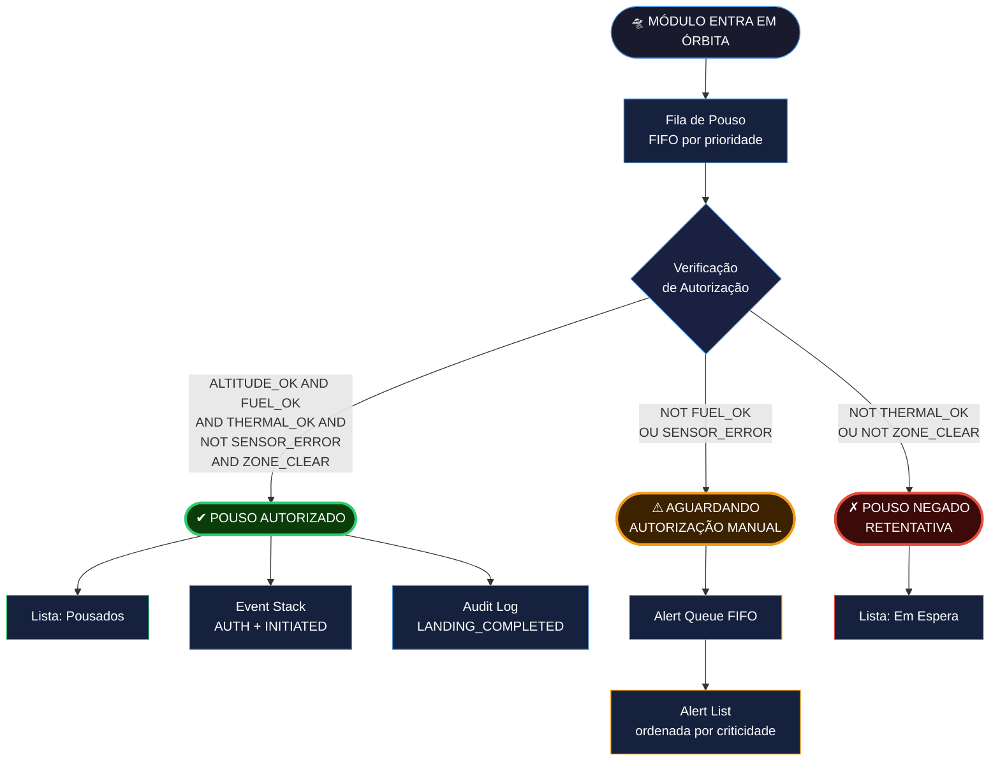
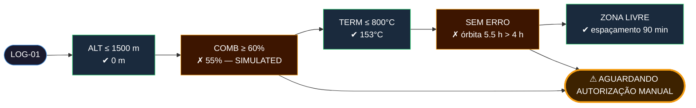
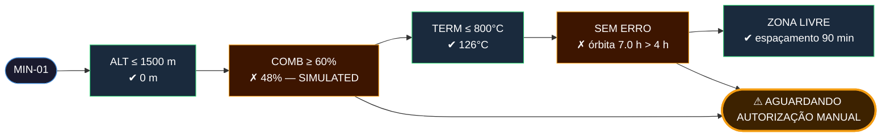
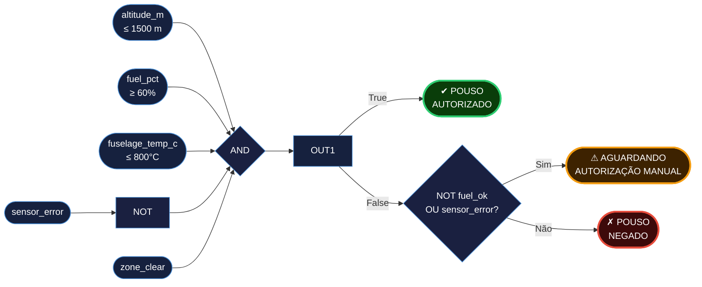

# ☄️ Aurora Siger — Landing Manager

 [](https://github.com/juliaramosguedes/fiap-fase-2-aurora-siger/actions/workflows/python.yml)

*Atividade Integradora · Fase 2 · Ciência da Computação, 2026 — FIAP*

🧑‍🚀 [Julia Ramos | RM568988](https://www.linkedin.com/in/juliaramosguedes) · [Matheus Fuchelberguer | RM569113](https://www.linkedin.com/in/matheus-fuchelberguer-neves/) · [Julio Joaquim | RM571321](https://github.com/jojigoats)

---

    

MGPEB — Módulo de Gerenciamento de Pouso e Estabilização de Base. A nave Aurora Siger entrou na órbita de Marte. Sete módulos precisam pousar — na ordem certa, com combustível suficiente, temperatura sob controle, sensores íntegros e zona de pouso disponível. O sistema decide quem pousa, quando, e quem aguarda autorização humana.

> [!IMPORTANT]
> Módulos com combustível abaixo de 60%, erro de sensor ou zona ocupada não recebem autorização automática.
> **Resistência é inútil** — os dados não mentem, e o sistema não negocia com física. 💥

---

## 🛸 Pipeline

```
Cenário de missão → Módulos com flags dinâmicos → Fila por prioridade → Telemetria calculada → Autorização booleana → Relatório
```

1. **Registro** — módulos construídos a partir do cenário injetado; `sensor_error` e `zone_clear` computados dinamicamente
2. **Fila de pouso** — Insertion Sort por `landing_priority`; FIFO de processamento
3. **Telemetria** — 4 modelos físicos do EDL calculam altitude, temperatura e combustível restante
4. **Autorização** — regra booleana de 5 condições; fail-safe: qualquer falha bloqueia autorização automática
5. **Roteamento** — AUTORIZADO → pousados + Event Stack; ALERTA → Alert Queue + override humano; NEGADO → espera

> [!CAUTION]
> Módulos com anomalias não pousam automaticamente. Sem autorização humana, a gravidade marciana toma a decisão — e ela não consulta a tripulação.



<details>
<summary>🔬 Decisão por módulo — 5 verificações em cadeia (cenário padrão)</summary>

<details>
<summary>LSS-01 — Life Support System (Prior. 1 · VITAL)</summary>


</details>

<details>
<summary>PWR-01 — Power Generation (Prior. 2 · VITAL)</summary>


</details>

<details>
<summary>HAB-01 — Inflatable Habitat (Prior. 3 · ALTA)</summary>


</details>

<details>
<summary>MED-01 — Medical Support (Prior. 4 · ALTA)</summary>


</details>

<details>
<summary>SCI-01 — Science Laboratory (Prior. 5 · MÉDIA)</summary>


</details>

<details>
<summary>LOG-01 — Logistics and Supplies (Prior. 6 · MÉDIA)</summary>



</details>

<details>
<summary>MIN-01 — ISRU Mining (Prior. 7 · BAIXA)</summary>



</details>

</details>

---

## 🛰 Arquitetura

**Funções puras** — sem efeitos colaterais; mesmo input sempre produz mesmo output. Cada verificação é testável individualmente — mandatório em sistemas de segurança crítica.

**Imutabilidade** — todos os estados via `@dataclass(frozen=True)`. Snapshots de telemetria e resultados de autorização não podem ser alterados após a criação.

**Fonte única da verdade** — limiares definidos uma vez em `src/constants.py`; reutilizados em autorização, exibição e modelos físicos.

**Flags dinâmicos** — `sensor_error` e `zone_clear` não são hardcoded. Derivados de `orbit_arrival_h` e do histórico de módulos pousados.

**Pousos sequenciais** — um módulo por vez, em ordem de prioridade. Rationale: simplifica resolução de conflito de zona e semântica da Event Stack. O ganho de paralelismo não justifica a complexidade para o escopo atual.

---

## ⚡ Regra de Autorização

```
LANDING_AUTHORIZED =
    ALTITUDE_OK          (altitude ≤ 1.500 m — limiar de ignição de retrofoguetes)
    AND FUEL_OK          (combustível ≥ 60% — margem para correção de trajetória)
    AND THERMAL_OK       (temperatura da fuselagem ≤ 800°C — integridade estrutural)
    AND NOT SENSOR_ERROR (nenhum sensor de navegação/altitude/temperatura com falha)
    AND LANDING_ZONE_CLEAR (zona desocupada, fora de região protegida planetária)
```

<details>
<summary>🔍 Diagrama de portas lógicas</summary>



</details>

---

## 🪐 Módulos da Missão

| Módulo | Nome | Prior. | Combustível | Criticidade | sensor_error | Status |
|---|---|---|---|---|---|---|
| LSS-01 | Life Support System | 1 | 78% | VITAL | False | ✔ Autorizado |
| PWR-01 | Power Generation | 2 | 85% | VITAL | False | ✔ Autorizado |
| HAB-01 | Inflatable Habitat | 3 | 62% | ALTA | False | ✔ Autorizado |
| MED-01 | Medical Support | 4 | 71% | ALTA | False | ✔ Autorizado |
| SCI-01 | Science Laboratory | 5 | 90% | MÉDIA | False | ✔ Autorizado |
| LOG-01 | Logistics and Supplies | 6 | 55% | MÉDIA | True | ⚠ Alerta |
| MIN-01 | ISRU Mining | 7 | 48% | BAIXA | True | ⚠ Alerta |

---

## 📡 Modelos Matemáticos

| Fenômeno | Modelo | Tipo | Variável alimentada |
|---|---|---|---|
| Altitude × tempo de descida | `h(t) = h₀ - v₀·t - ½·g·t²` | Quadrática | `ALTITUDE_OK` |
| Força de arrasto × velocidade | `F(v) = k·v²` | Quadrática | `FUEL_OK` |
| Temperatura fuselagem × tempo | `T(t) = T_sup + (T_ent-T_sup)·e^(-λt)` | Exponencial | `THERMAL_OK` |
| Consumo de combustível × tempo | `C(t) = C₀ - r·t` | Linear | `FUEL_OK` |

---

## 🌙 Estruturas de Dados

| Estrutura | Tipo | Papel |
|---|---|---|
| Landing Queue | deque — FIFO | Módulos aguardando autorização, por prioridade |
| Alert Queue | deque — FIFO | Hub de entrada de alertas — nenhum alerta perdido |
| Alert List | Lista ordenada por criticidade | Visão de trabalho do operador humano |
| Landed List | Lista cronológica | Módulos pousados com sucesso |
| Waiting List | Lista | Módulos aguardando zona ou térmica |
| Event Stack | Lista — LIFO | Ações reversíveis: AUTH_GRANTED, LANDING_INITIATED |
| Audit Log | Lista append-only | Fatos e eventos não reversíveis — histórico completo |

---

## ⭐ Algoritmos

| Algoritmo | Uso | Complexidade | Justificativa |
|---|---|---|---|
| Insertion Sort | Ordenação por prioridade | O(n²) | n=7: microssegundos. Estável + zero memória auxiliar (RAD750) |
| Selection Sort | Ordenação por combustível | O(n²) | Mínimo de trocas — identifica módulos em risco |
| Hash Index | Lookup por module_id e criticidade | O(1) | Dict construído uma vez; consultas repetidas em O(1) |
| Busca Linear | Módulos por janela de chegada | O(n) | Lista não ordenada por arrival_h — scan completo necessário |
| Busca Binária | Módulo por prioridade | O(log n) | Aproveita lista já ordenada pelo Insertion Sort |

---

## 🚀 Como executar

Sem dependências externas. Biblioteca padrão Python 3.9+.

```bash
# cenário padrão — 7 módulos fixos
python landing_manager.py

# cenário aleatório — n módulos procedurais
python landing_manager.py --n 10

# com anomaly-pct e seed para reprodutibilidade
python landing_manager.py --n 10 --anomaly-pct 0.4 --seed 42
```

---

## 🌌 Estrutura

```
fiap-fase-2-aurora-siger/
├── landing_manager.py      ← entry point
├── ENGINEERING_GUIDE.md    ← walkthrough completo do código para engenheiros
├── src/
│   ├── enums.py            ← Criticality, AlertSeverity, Decision, EventType
│   ├── constants.py        ← limiares numéricos e constantes físicas
│   ├── models.py           ← dataclasses imutáveis
│   ├── scenarios.py        ← LandingModuleConfig, default_scenario(), random_scenario()
│   ├── physics.py          ← 4 modelos matemáticos do EDL
│   ├── authorization.py    ← check_* + evaluate_authorization + flags dinâmicos
│   ├── structures.py       ← operações sobre fila, pilha, log
│   ├── algorithms.py       ← insertion sort, selection sort, buscas, índices O(1)
│   ├── display.py          ← funções de exibição
│   ├── registry.py         ← build_modules(configs)
│   └── simulation.py       ← simulate_landing_sequence() + main(scenario?)
└── docs/
    ├── landing-modules-reference.md
    ├── thresholds-reference.md
    └── esg-reference.md
```

---

## 🔭 Referências

| Parâmetro | Fonte |
|---|---|
| Altitude de ignição de retrofoguetes (1 500 m) | NASA JPL — MSL EDL Overview (2012) |
| Limite de combustível (60%) | ESA Advanced Concepts Team (2021) |
| Limite térmico da fuselagem (800°C) | Edquist, K. et al. — AIAA 2009-4117 |
| Constante de decaimento térmico λ | NASA JPL — MEDLI (2012) · SIMULATED |
| Gravidade marciana (3.72 m/s²) | NASA Mars Fact Sheet |
| Temperatura de superfície de Marte (-60°C) | NASA Mars Fact Sheet |
| Limiar de exposição à radiação (4h) | NASA Human Research Program · SIMULATED |
| Janela de zona de pouso (30 min) | Golombek et al., Space Science Reviews (2012) |
| Algoritmos de busca e ordenação | Cormen et al. — Introduction to Algorithms, MIT Press (2009) |
| Padrão de auditabilidade | ESA ECSS-E-ST-70-11C Software Engineering Standard |
| Critérios ESG | ISO 26000 / Triple Bottom Line (Elkington, 2018) |

> [!NOTE]
> Valores marcados como `# SIMULATED` no código foram estimados com base em ordens de grandeza documentadas.
> Consulte [`docs/thresholds-reference.md`](docs/thresholds-reference.md) para as justificativas completas.

---

> [!IMPORTANT]
> *"A lógica é o começo da sabedoria, não o fim."* 🖖
